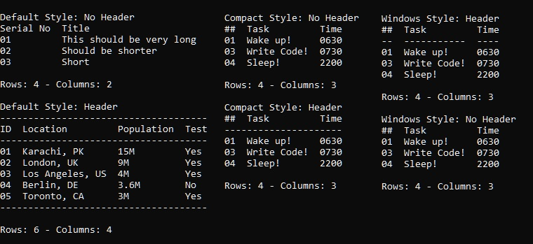

# styliCe

StyliCe:  A C library for creating stylised console tables

## Features

- Three formatting styles (Default, Compact and Windows)
- Header support
- Upto 16 columns supported (redefine MAX_COLUMNS if you need more or less)

## Example

```c
printf("\nDefault Style: Header\n");
table *instance;
if ((instance = table_Init(styleDefault, true)) != NULL) {
    table_AddRow(instance, "ID\tLocation\tPopulation\tTest");
    table_AddRow(instance, "01\tKarachi, PK\t15M\tYes");
    table_AddRow(instance, "02\tLondon, UK\t9M\tYes");
    table_AddRow(instance, "03\tLos Angeles, US\t4M\tYes");
    table_AddRow(instance, "04\tBerlin, DE\t3.6M\tNo");
    table_AddRow(instance, "05\tToronto, CA\t3M\tYes");
    table_Print(instance);
    printf("Rows: %d - Columns: %d\n", table_GetRowCount(instance), table_GetColumnCount(instance));
    table_Delete(instance);
}
```



### How to build

```bash
cd .\example\
gcc -I..\src\ example.c -o example.exe ..\src\stylice.c
```

## License

MIT
